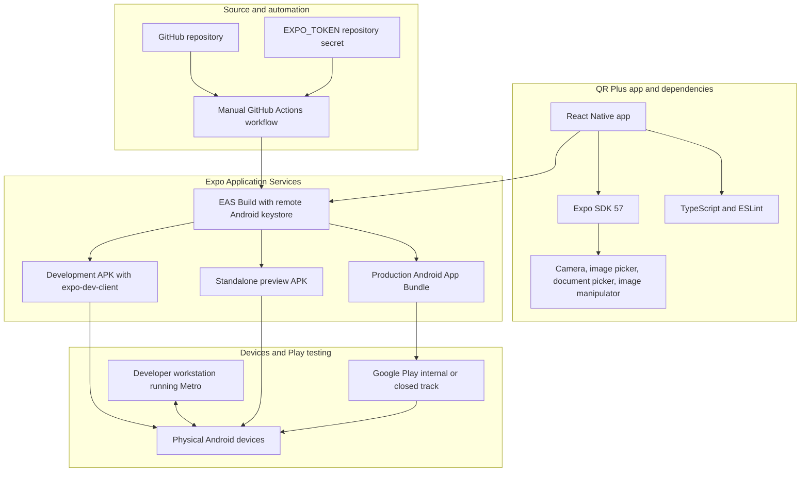

# QR Plus

QR Plus is an Expo and React Native QR code reader for Android, iOS, and web.
It can scan a QR code with the live camera or read one or more codes from an
image selected from the photo library or device files.

## Requirements

- Node.js and npm
- Expo SDK 57 (the project uses Expo `~57.0.26`)
- Expo Go for running on a physical device, or an Android/iOS development
  environment for a native build

## Getting started

Install dependencies and start Metro:

```sh
npm install
npx expo start
```

Open the project in Expo Go by scanning the terminal QR code. To launch an
available Android emulator directly, run:

```sh
npx expo start --android
```

## Using the app

- Grant camera access to scan a QR code live. Use the flashlight control when
  needed.
- Choose **Photo library** to scan an image, or **Browse files** to select a
  downloaded image.
- If an image contains multiple QR codes, select the desired result from the
  list. On Android, the app scans overlapping image crops when the initial
  full-image scan finds fewer than two distinct codes. Larger, sharper codes
  generally scan more reliably.
- Review the decoded contents, share them, or open the result when it is a web
  link.

## Dependencies

Runtime dependencies:

- `expo`, `react`, and `react-native` provide the application runtime.
- `expo-camera` handles live camera scanning and QR detection in images.
- `expo-image-picker` and `expo-document-picker` select images from the device.
- `expo-image-manipulator` creates image crops for Android multi-code scans.
- `expo-status-bar` and `react-native-safe-area-context` integrate with native
  screen layout.
- `lucide-react-native` provides icons and uses `react-native-svg`.

Development dependencies include TypeScript, ESLint, and the Expo ESLint
configuration.

When adding or changing Expo modules, use `npx expo install <package>` so the
installed version matches the project's SDK.

## Build and Distribution Architecture



- **Development:** Install the development APK on devices and run Metro on the
  developer workstation. The app connects to Metro for live JavaScript updates.
- **Standalone testing:** Build the preview APK and share its EAS install link;
  testers do not need Metro or the Play Store.
- **Play testing:** Build the production AAB and upload it to a Play internal or
  closed testing track. Google Play distributes it to opted-in testers.

## App identity

The Android application ID is `com.coreaxiom.qrplus`, configured as
`expo.android.package` in `app.json`.

## Checks

```sh
npx expo lint
npx tsc --noEmit
```
